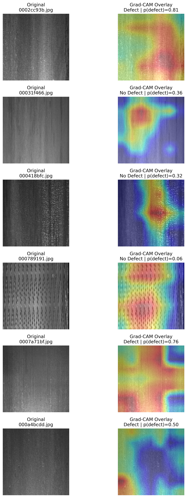

# Industrial Defect Classification with Explainable AI

An end-to-end computer vision project for **industrial quality control**, focused on steel surface defect classification using transfer learning and Explainable AI.

The project builds a CNN-based visual inspection pipeline that classifies steel images as **Defect** or **No Defect**, evaluates the model with quality-control-relevant metrics, and applies **Grad-CAM** to visualize which image regions influenced the model’s decisions.

---

## Key Results

| Area | Result |
|---|---|
| Task | Binary steel surface defect classification |
| Model | MobileNetV2 transfer learning |
| Test Accuracy | 85.15% |
| Test Precision | 84.48% |
| Test Recall | 88.20% |
| Test F1-score | 86.30% |
| Explainability | Grad-CAM visual explanations |
| Critical QC metric | False negatives analyzed |

From an industrial quality control perspective, **recall** is especially important because false negatives represent defective products that may pass inspection as acceptable.

---

## Project Highlights

- Built a complete visual inspection workflow from data exploration to model evaluation and explainability.
- Converted the original Severstal steel defect dataset into a binary **Defect / No Defect** classification task.
- Trained a pretrained **MobileNetV2 CNN** using transfer learning.
- Evaluated model performance using accuracy, precision, recall, F1-score, and confusion matrix.
- Interpreted model predictions using **Grad-CAM** heatmaps.
- Documented limitations and future improvements from an industrial deployment perspective.

---

## Grad-CAM Explainability

Grad-CAM was applied to the trained MobileNetV2 model to visualize which image regions contributed most to the model’s prediction.

This helps assess whether the model is focusing on meaningful surface regions instead of relying only on irrelevant background patterns.



The heatmaps provide a **coarse visual explanation** of the model’s decision. Red and yellow regions indicate stronger contribution to the prediction, while darker regions indicate lower contribution.

Because Grad-CAM is generated from the final convolutional feature maps, it should not be interpreted as exact pixel-level defect localization.

---

## Project Overview

Industrial visual inspection is a key part of quality control in manufacturing. In real production environments, a model’s prediction is not enough on its own: engineers and operators also need to understand **why** a model made a decision.

This project demonstrates how deep learning and Explainable AI can be combined for industrial defect inspection.

The pipeline includes:

```text
data exploration
→ binary label preparation
→ CNN model training
→ model evaluation
→ Grad-CAM explainability
```

The project is designed as a practical portfolio demonstration at the intersection of:

- Industrial AI
- Computer vision
- Quality control
- Deep learning
- Explainable AI

---

## Dataset

The project uses the **Severstal Steel Defect Detection** dataset from Kaggle.

The original dataset contains steel surface images and defect annotations. For this project, the task was simplified into a binary classification problem:

- `0` = No Defect
- `1` = Defect

The raw dataset is not included in this repository because of file size and licensing considerations.

Expected local data structure:

```text
data/raw/
├── train_images/
├── test_images/
├── train.csv
└── sample_submission.csv
```

---

## Repository Structure

```text
industrial-defect-xai-demo/
├── notebooks/
│   ├── 01_data_exploration.ipynb
│   ├── 02_model_training.ipynb
│   └── 03_gradcam_explainability.ipynb
│
├── models/
│   └── mobilenetv2_baseline.keras
│
├── results/
│   ├── training_accuracy.png
│   ├── training_loss.png
│   ├── confusion_matrix.png
│   └── gradcam_examples.png
│
├── data/                                # ignored by GitHub
├── .gitignore
├── requirements.txt
└── README.md
```

---

## Stage 1 — Data Exploration

The first notebook explores the dataset and prepares the binary labels used for model training.

Main steps:

- Loaded and inspected the original annotation file.
- Cleaned one problematic row with missing values.
- Created image-level binary labels.
- Checked the distribution of defective and non-defective images.
- Saved the binary labels locally for training.

Dataset summary after preprocessing:

| Category | Number of images | Percentage |
|---|---:|---:|
| Defect | 6,666 | 53.04% |
| No Defect | 5,902 | 46.96% |
| Total | 12,568 | 100% |

The dataset is reasonably balanced for a first binary classification baseline.

---

## Stage 2 — Model Training

The second notebook trains a baseline deep learning model for binary steel defect classification.

The model was trained using **Google Colab with GPU acceleration**, while the project structure and notebooks were organized locally in **VS Code** and version-controlled with Git/GitHub.

### Model Architecture

The model uses transfer learning with **MobileNetV2 pretrained on ImageNet**.

Architecture summary:

```text
MobileNetV2 backbone
→ Global Average Pooling
→ Dropout
→ Dense sigmoid output
```

### Training Setup

| Setting | Value |
|---|---|
| Image size | 224 × 224 |
| Batch size | 32 |
| Dataset split | 70% train / 15% validation / 15% test |
| Optimizer | Adam |
| Learning rate | 0.0001 |
| Loss function | Binary crossentropy |
| Epochs | 10 |

---

## Model Performance

The MobileNetV2 baseline achieved the following results on the test set:

| Metric | Score |
|---|---:|
| Accuracy | 85.15% |
| Precision | 84.48% |
| Recall | 88.20% |
| F1-score | 86.30% |

### Confusion Matrix

|  | Predicted No Defect | Predicted Defect |
|---|---:|---:|
| Actual No Defect | 724 | 162 |
| Actual Defect | 118 | 882 |

### Industrial Interpretation

In industrial quality control, the most critical error type is usually the **false negative**:

```text
Actual Defect → Predicted No Defect
```

This means that a defective product could pass inspection as acceptable.

In this baseline model:

```text
False negatives = 118
Recall = 88.20%
```

The model detects most defective images, but future optimization should focus on reducing false negatives further.

---

## Stage 3 — Grad-CAM Explainability

The third notebook adds an initial explainability layer using **Grad-CAM**.

Grad-CAM helps visualize the image regions that contributed most to the CNN’s prediction.

The workflow is:

```text
load trained model
→ select sample steel images
→ predict Defect / No Defect
→ generate Grad-CAM heatmaps
→ overlay heatmaps on original images
→ save Grad-CAM examples
```

Output:

```text
results/gradcam_examples.png
```

This step improves model transparency and supports trust in industrial inspection settings.

---

## Current Limitations

This is an initial baseline project, so several limitations remain:

- The original steel strip images are very wide, but they were resized to 224 × 224 for compatibility with MobileNetV2.
- Square resizing may distort the aspect ratio and reduce sensitivity to small or thin defects.
- The model currently performs binary classification only, not defect localization or segmentation.
- Grad-CAM provides coarse visual explanations, not precise pixel-level defect localization.
- The model has not yet been optimized specifically to reduce false negatives.
- The current approach does not yet compare Grad-CAM heatmaps with the original segmentation masks.

---

## Future Improvements

Possible next steps include:

- Error analysis of false positives and false negatives.
- Threshold tuning to reduce false negatives.
- Fine-tuning the MobileNetV2 backbone.
- Comparison with other pretrained CNNs such as EfficientNetB0 or ResNet.
- Patch-based classification to better handle wide steel strip images.
- Aspect-ratio-preserving preprocessing.
- Additional XAI methods such as Grad-CAM++, Score-CAM, Integrated Gradients, Occlusion Sensitivity, LIME, or SHAP.
- Comparison between Grad-CAM heatmaps and true defect masks from the original annotations.
- Extension from binary classification to defect localization or segmentation.

---

## Skills Demonstrated

This project demonstrates practical experience with:

- Python
- Pandas / NumPy
- TensorFlow / Keras
- CNNs and transfer learning
- MobileNetV2
- Computer vision for industrial inspection
- Data exploration and preprocessing
- Binary classification
- Model evaluation with accuracy, precision, recall, F1-score, and confusion matrix
- Industrial interpretation of false positives and false negatives
- Grad-CAM explainability
- Google Colab GPU training
- VS Code
- Git and GitHub project organization

---

## Project Status

| Stage | Status |
|---|---|
| Data exploration | Completed |
| Binary label preparation | Completed |
| MobileNetV2 model training | Completed |
| Model evaluation | Completed |
| Grad-CAM explainability | Completed |
| GitHub documentation | Completed |

---

## Project Goal

The goal of this project is not only to build a defect classifier, but to demonstrate how AI models can become more useful, transparent, and trustworthy in industrial quality control when combined with explainability methods.

This project is part of my broader interest in **Industrial AI, visual inspection, quality control, and Explainable AI**.
