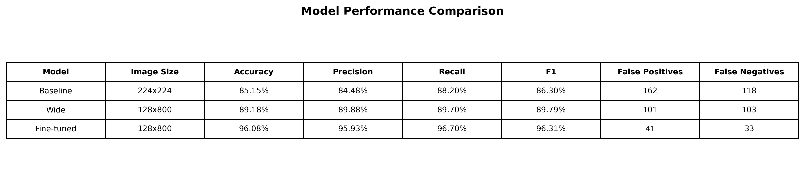
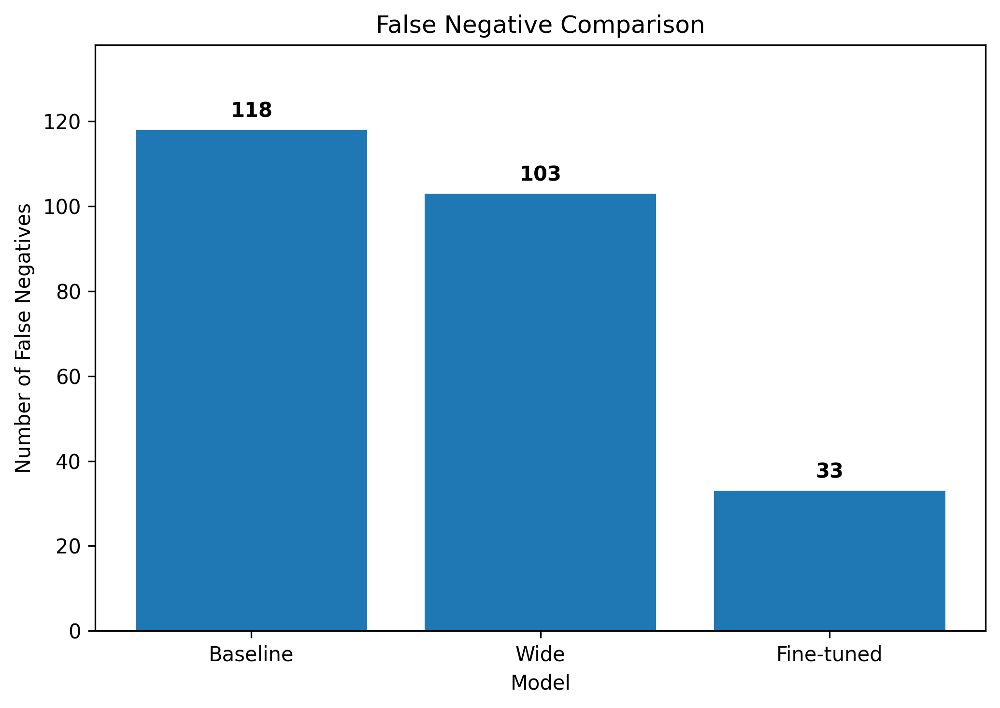
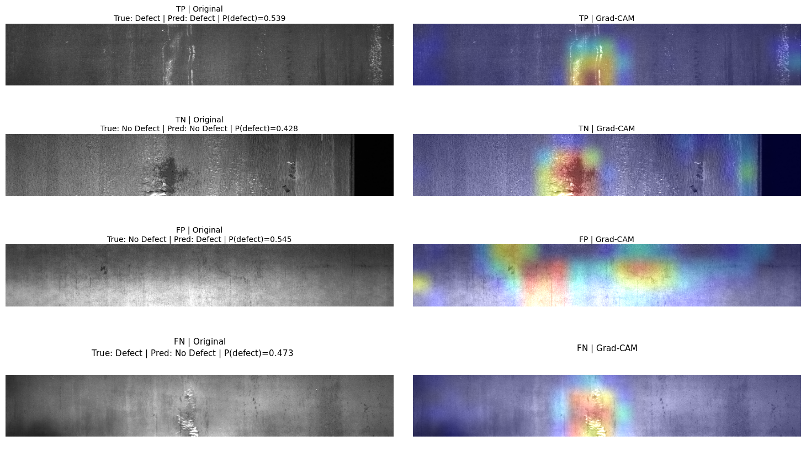
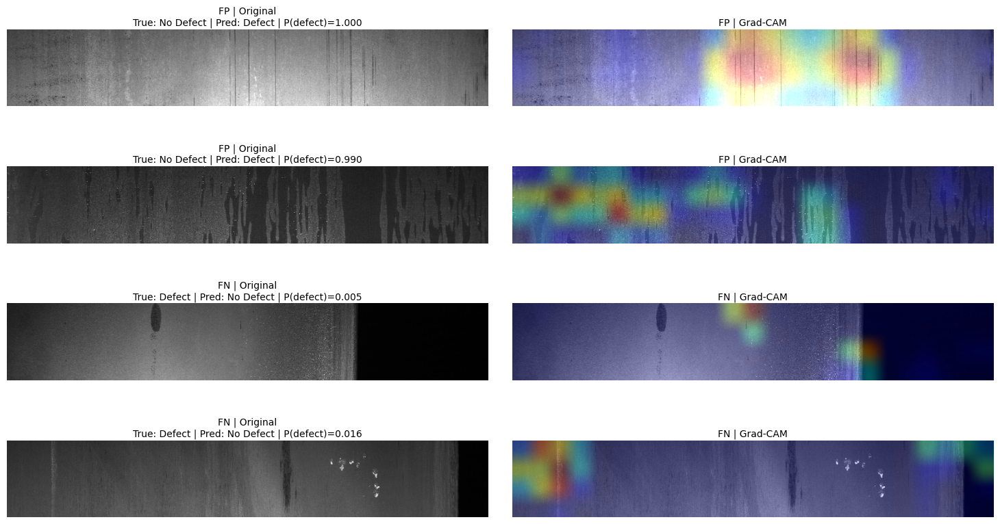

# Industrial Defect Classification with Explainable AI

An end-to-end computer vision project for steel surface defect classification.

The project uses **MobileNetV2** to classify each image as **Defect** or **No Defect**. It also uses **Grad-CAM** to show which image regions influenced the model's predictions.

The main goal is to combine model performance with simple and useful explanations for industrial quality inspection.

## Project Workflow

```text
data preparation
→ baseline model
→ wide-image preprocessing
→ fine-tuning
→ model evaluation
→ Grad-CAM error analysis
```

## Main Results

Three versions of the model were evaluated on the same test set of 1,886 images.

| Model | Input size | Accuracy | Precision | Recall | F1-score | False Positives | False Negatives |
|---|---:|---:|---:|---:|---:|---:|---:|
| Baseline | 224 × 224 | 85.15% | 84.48% | 88.20% | 86.30% | 162 | 118 |
| Wide model | 128 × 800 | 88.23% | 88.29% | 89.70% | 88.99% | 119 | 103 |
| Fine-tuned model | 128 × 800 | **95.18%** | **94.43%** | **96.60%** | **95.50%** | **57** | **34** |

The final fine-tuned model achieved the best overall performance. It reduced false negatives from **118 to 34**, a reduction of about **71.2%** compared with the baseline.





## Why False Negatives Matter

In industrial inspection, a false negative means:

```text
Actual Defect → Predicted No Defect
```

This is important because a defective product may pass the inspection as acceptable. For this reason, the project gives particular attention to **recall** and the number of **false negatives**.

## Model Development

The baseline model resized all images to `224 × 224`. However, the original Severstal images are very wide, so square resizing changes their shape and may compress small or narrow defects.

The improved model uses an input size of `128 × 800`, which preserves more of the original steel-strip geometry. The final stage fine-tunes part of the MobileNetV2 backbone using a low learning rate.

Final architecture:

```text
128 × 800 RGB image
→ MobileNetV2 backbone
→ Global Average Pooling
→ Dropout
→ Sigmoid output
```

## Grad-CAM Analysis

Grad-CAM is used to highlight the image regions that contributed to the model's defect score.

The final XAI notebook examines:

- borderline predictions close to the `0.50` decision threshold;
- false positives and false negatives;
- errors made with high model confidence;
- image regions that may have influenced these predictions.

The range `0.40–0.60` is used as a practical **borderline review band**. It is not a formal measure of model uncertainty.

### Borderline Predictions



### High-Confidence Errors



Grad-CAM provides a coarse visual explanation. It should not be treated as exact pixel-level defect localization or segmentation. The heatmaps are also normalized separately for each image, so their color intensity should not be compared directly across different examples.

## Dataset

The project uses the [Severstal Steel Defect Detection](https://www.kaggle.com/competitions/severstal-steel-defect-detection) dataset.

The original annotations were converted into an image-level binary classification task:

- `0` — No Defect
- `1` — Defect

Dataset after preprocessing:

| Category | Images | Percentage |
|---|---:|---:|
| Defect | 6,666 | 53.04% |
| No Defect | 5,902 | 46.96% |
| Total | 12,568 | 100% |

The raw dataset is not included in this repository because of its size and Kaggle access requirements.

Expected local structure:

```text
data/raw/
├── train_images/
├── test_images/
├── train.csv
└── sample_submission.csv
```

## Repository Structure

```text
industrial-defect-xai-demo/
├── notebooks/
│   ├── 01_data.ipynb
│   ├── 02_baseline.ipynb
│   ├── 03_improved_model_final.ipynb
│   └── 04_xai_gradcam_error_analysis.ipynb
├── models/
│   ├── mobilenetv2_baseline.keras
│   ├── mobilenetv2_wide.keras
│   ├── mobilenetv2_finetuned.keras
│   └── mobilenetv2_wide_finetuned_final.keras
├── results/
│   ├── model_comparison.png
│   ├── false_negative_comparison.png
│   ├── final_confusion_matrix.png
│   ├── gradcam_examples.png
│   └── additional metrics and plots
├── data/                         # ignored by Git
├── .gitignore
├── LICENSE
├── requirements.txt
└── README.md
```

## Notebooks

1. **`01_data.ipynb`** — explores the dataset and creates binary labels.
2. **`02_baseline.ipynb`** — trains and evaluates the baseline MobileNetV2 model.
3. **`03_improved_model_final.ipynb`** — applies wide-image preprocessing, fine-tuning, and model comparison.
4. **`04_xai_gradcam_error_analysis.ipynb`** — applies Grad-CAM to borderline predictions and model errors.

The saved Grad-CAM case study uses `mobilenetv2_wide_finetuned_final.keras` so that its displayed predictions and figures remain consistent. The notebook can also be switched to `mobilenetv2_finetuned.keras` and rerun as a new experiment.

## How to Run

1. Clone the repository.
2. Install the required packages:

```bash
pip install -r requirements.txt
```

3. Download the Severstal dataset from Kaggle and place it in `data/raw/`.
4. Run the notebooks in numerical order.

The models were trained in **Google Colab with GPU acceleration**. The notebooks and project files were organized locally in **VS Code**.

## Technologies

- Python
- TensorFlow / Keras
- MobileNetV2 and transfer learning
- Pandas and NumPy
- Scikit-learn
- Matplotlib and Seaborn
- Grad-CAM
- Google Colab
- Git and GitHub

## Limitations

- The task is binary classification, not defect segmentation.
- Grad-CAM gives coarse explanations and not exact defect boundaries.
- The model has not been tested in a real production environment.
- The model probabilities have not been formally calibrated.
- The Grad-CAM heatmaps have not been compared quantitatively with the original segmentation masks.

## Project Goal

The goal is not only to classify steel defects, but also to show how Explainable AI can help engineers and inspectors review difficult predictions and better understand a model's behavior.

This project is part of my broader interest in **computer vision, industrial quality control, and Explainable AI**.

